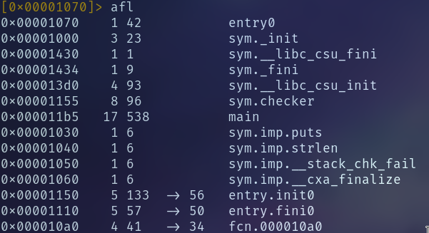
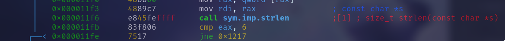
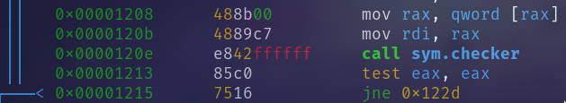

# Challenge Information

> Author: f0rizen
> Language: C/C++
> Difficulty: 2.6
> Arch: x86-64

Solution: `./crackme 231337`

# Initial Auditing

I began by running the binary and got a help message as the output.

I started tried passing an argument but got the same message so I
decided to disassemble the binary.

# Disassembly
After running `afl` we see that there is a two user defined functions
`main` and `checker`

Once I disassembled main I realized that the program first checks two
conditions.

1. The length of the argument must be six characters

1. The argument must pass the check function

## Checker

Disassembling checker yields

The method iterates through each character of the argument passed, and checks
that every character is between 0 and 9.

## Magic Array

If both checks are passed then a loop is used to fill an array of constants
that are `[0x1,0x83,0x4309,0x224d9b,0x118db651,0x228a4e1d]`. The array is
filled using the function $x_{n-1} \times$ 0x83 mod 0x3b9aca09. Where $x_0$ = 1.

Each element of the array is plugged into a function along with the
corresponding character to get the hash value. The function is described in
the second loop.

It can be written out as:

$\sum_{n=0}^{5} (i_n \times x_n) mod$ 0x3b9aca09

Where the $i_n$ is the $n_{th}$ element of the inputted argument and $x_n$ is the
$n_{th}$ element of the magic array.

# Solution
I wrote a python script that brute forces every possible key. This has O(n)
complexity preforming 1000000 operations. The script takes about 20 minutes
to find the correct key. I do not like the solution and want to spend more time
refining the keygen using properties of modular arithmetic.
