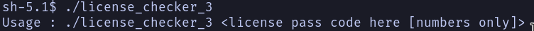
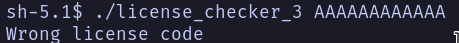
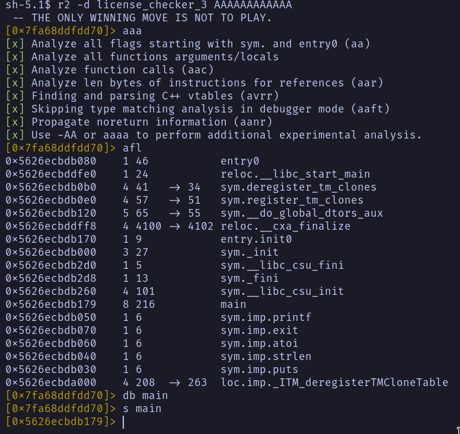
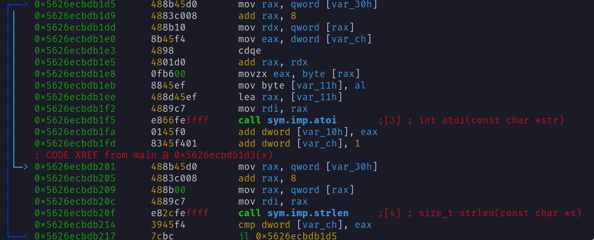
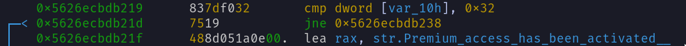
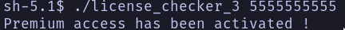

# Challenge Information
> Author: pourmeadrinkwhileimfloating

> Language: C/C++

> Difficulty: 1.7

> Arch: x86-64

Solution: ```./license_checker_3 5555555555```
# Initial Auditing
Despite the source code of the challenge being in the description I refrained
from looking at it as I wanted to try to understand what the code did from the
assembly code.

To start off I ran the binary and got help message as the output.


Because I could not read, I tried a random input `AAAAAAAAAAAA` and the got an
output.



# Disassembly
I ran the program using radare2 with `r2 -d ./license_checker_3 AAAAAAAAAAAA`
and ran `aaa`,`afl`,`db main`, `s` main`, `V`, `p`,and `p`.


After looking at the disassembly for a while, I realized that there was a loop
that went through every single character of the inputted argument and added the
integer value to a counter stored in `[rbp-0xc]`.


After iterating through every character of the string it compares the counter
to `0x32` or 50 is decimal. If the sum is 50, you pass the license check and
solve the challenge.


## Atoi
To get the integer value of each character, `atoi()` is called. After looking up
the function, I realized that my input had to be integers and could not be
characters. So it is not that the binary will not accept character input, but
rather that it will not work because `atoi()` of any character is 0.

# Solution
So the argument that is inputted just needs to be a string of integers that add
up to 50. So I put used the argument `5555555555`. And re-ran the program.


